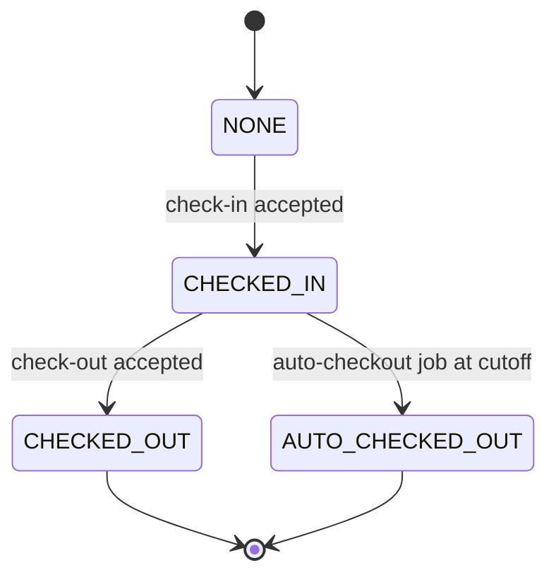

# JAAGO HUB — Attendance Module (GPS Check-In / Check-Out)
## Antigravity AI Build Prompt

> **How to use this document:** This is an amendment to the JAAGO HUB master prompt ("the constitution"). Everything in the constitution still governs — the three-service topology, Drizzle + the two Supabase projects, the `nest build && tsc-alias` build step with no new workspace symlinks, `@/core/*` and `@/shared/*` plain-source layout, RBAC + RLS defense-in-depth, migrations-only schema changes (no raw DDL), the Pino logger with path-based structural redaction, the `deploy_ready/` assembler, and the engineering priority order **data integrity → security & authorization → reliability → performance → developer experience → convenience**. Do **not** re-derive or contradict any of it. Build this feature as a Tier-1 developer module named `attendance` that conforms to the module manifest contract.

---

## 0. Objective

Build a standard, HR-grade attendance tracker for all employees, available on every client (web and mobile), where check-in and check-out are gated by GPS geofence verification against coordinates configured in Admin Settings. From the raw check-in/check-out facts and each employee's assigned working shift, the system must derive **Present / Late / Absent / On-Leave / Weekly-Off / Holiday**, handle **auto check-out** for employees who forget, and surface the *same* canonical data in three places:

1. **My Dashboard → Monthly Attendance Summary** (employee self-service).
2. **People & Culture → Attendance Logs** (HR/admin).
3. **Employee My Dashboard → Attendance & Leave tab**.

Because these are read surfaces over one source of truth, any correction made anywhere is reflected everywhere with no cross-table syncing.

---

## 1. Prime directive for this module: ONE source of truth, everything else derived

This is the single most important design constraint and the root cause of every requirement in the brief ("link with one another", "reflect everywhere", "adjusting check-in also changes Late/Auto-checkout").

- **Store facts, derive states.** The only stored *facts* are: the check-in timestamp, the check-out timestamp, how each was captured (source), the GPS evidence, and the shift parameters that applied on that date. **Late, Absent, Auto-checkout, and worked-hours are never stored as independent editable values** — they are computed by a single deterministic function from those facts.
- **Do not duplicate attendance anywhere.** The employee profile, both dashboards, the monthly summary, and the People & Culture logs must all **read from the same `attendance_records` table (and views over it)**. No surface keeps its own copy. If you introduce a cached/materialized monthly-summary projection for the constitution's performance targets, it must be invalidated or rebuilt atomically on every attendance mutation — it is a cache, not a second source of truth.

Getting this right makes "reflect everywhere" automatic and makes "recalculate on edit" a single function call.

---

## 2. Invariants (must hold at all times; enforce in code, tests, and DB constraints)

- **I1** — Exactly one canonical `attendance_records` row per `(employee_id, business_date)`. Enforce with a unique constraint.
- **I2** — All derived columns (`status`, `is_late`, `late_by_minutes`, `is_auto_checkout`, `worked_minutes`, `early_leave_by_minutes` if used) are written **only** by `recomputeAttendanceRecord()`. No controller, job, or migration writes them by any other path.
- **I3** — Every mutation of `check_in_at` or `check_out_at`, from **any** source (employee GPS action, auto-checkout job, HR/admin adjustment), runs inside **one transaction** that (a) appends an immutable row to `attendance_adjustments`, and (b) calls `recomputeAttendanceRecord()`. Both commit together or the whole thing rolls back.
- **I4** — When both are present, `check_out_at >= check_in_at`, except for shifts explicitly flagged as crossing midnight.
- **I5** — No raw browser writes to Supabase; all mutations go through the API. All schema changes go through Drizzle migrations. No raw DDL from any runtime path (this includes Studio-lite).
- **I6** — GPS acceptance is decided **server-side**. The client only submits raw coordinates; it never asserts "I am in range."
- **I7** — The shift parameters used to evaluate a record are **snapshotted onto that record**. Editing a shift *definition* later must not silently rewrite historical records' derived state. Shift-definition edits affect **future** records only, unless an admin explicitly runs a bounded "re-apply shift to date range" action.
- **I8** — All three dashboard surfaces derive from the same canonical table/views. Any cached projection is invalidated on mutation.
- **I9** — "Absent" is finalized only for **closed** business dates and never overrides approved leave, weekly-offs, or holidays.

---

## 3. Data model (Drizzle, transactional Supabase project)

Create these tables via migrations. Names are indicative; keep them consistent with existing conventions.

### 3.1 `work_shifts` (a.k.a. working schedules)
- `id`, `name`, `is_active`
- `timezone` (IANA, default `Asia/Dhaka`)
- `start_time_local` (wall-clock, e.g. `10:00`)
- `end_time_local` (wall-clock, e.g. `18:00`)
- `start_buffer_minutes` (grace period for lateness, e.g. `30`)
- `crosses_midnight` (boolean, default false) — supports night shifts without forcing them now
- `auto_checkout_local` (nullable wall-clock; when null, fall back to the global attendance setting)
- `working_weekdays` (set of weekdays this shift is worked; everything else is a weekly-off)
- effective-dating columns if shift definitions themselves are versioned (optional; not required for v1)

### 3.2 `employee_shift_assignments` (effective-dated)
- `id`, `employee_id` (FK to the existing employee profile), `shift_id` (FK), `effective_from` (date), `effective_to` (date, nullable = open-ended)
- Resolve "which shift applied on date D for employee E" by the assignment whose range contains D. Guard against overlapping open ranges.

### 3.3 `geofence_locations` (Admin Settings — the GPS source of truth)
- `id`, `name`, `is_active`
- `latitude`, `longitude` (store with full precision)
- `radius_meters` (per-location tolerance)
- Optional `employee_scope` / join table if some staff are bound to specific sites; default is "any active geofence is acceptable."

### 3.4 `attendance_records` (the ONE canonical row per employee per day)
Facts:
- `id`, `employee_id`, `business_date` (local date the record belongs to)
- `check_in_at` (timestamptz, nullable), `check_out_at` (timestamptz, nullable)
- `check_in_source` / `check_out_source` — enum: `gps` | `manual` | `admin` | `auto`
- `check_in_location_id` / `check_out_location_id` (FK to geofence that validated it, nullable)
- `check_in_lat`, `check_in_lng`, `check_in_accuracy_m`, `check_out_lat`, `check_out_lng`, `check_out_accuracy_m` (evidence; treat as sensitive — see §11)

Shift snapshot (frozen at record creation, per **I7**):
- `shift_id`, `shift_timezone`, `shift_start_local`, `shift_end_local`, `shift_buffer_minutes`, `shift_auto_checkout_local`, `shift_crosses_midnight`, `is_scheduled_working_day` (was this a working weekday for that shift)

Derived (written only by recompute, per **I2**):
- `status` — enum: `present` | `late` | `absent` | `on_leave` | `weekly_off` | `holiday`
- `is_late` (bool), `late_by_minutes` (int)
- `is_auto_checkout` (bool)
- `worked_minutes` (int, nullable)

Constraints: unique `(employee_id, business_date)`; check `worked_minutes >= 0`.

### 3.5 `attendance_events` (append-only physical audit — every attempt)
Immutable log of every check-in/out **attempt**, accepted or rejected:
- `id`, `employee_id`, `event_type` (`check_in` | `check_out`), `attempted_at`
- `latitude`, `longitude`, `accuracy_m`, `captured_at`, `device_info`
- `result` (`accepted` | `rejected`), `rejection_reason` (enum: `outside_geofence` | `poor_accuracy` | `stale_coordinates` | `already_checked_in` | `not_checked_in` | `already_checked_out` | `outside_allowed_window` | …)
- `matched_location_id` (nullable), `distance_m` (nullable)

This is the anti-fraud / dispute-resolution record. It is never edited.

### 3.6 `attendance_adjustments` (append-only edit audit — per I3)
- `id`, `attendance_record_id`, `field_changed` (`check_in_at` | `check_out_at` | …), `old_value`, `new_value`, `changed_by` (user id), `changed_at`, `reason` (required for HR/admin edits)

### 3.7 Global attendance settings (Admin Settings)
- `org_timezone` (default `Asia/Dhaka`)
- `default_auto_checkout_local` (default `23:30`)
- `gps_accuracy_threshold_m` (default e.g. `100`)
- `gps_coordinate_freshness_seconds` (default e.g. `120`)
- `default_geofence_radius_m`

---

## 4. Time & timezone rules (get this exactly right)

- All timestamps are stored in UTC (`timestamptz`). **All human-facing rules — shift start, buffer, auto-checkout cutoff, business date, lateness — are evaluated in the shift's local timezone** (default `Asia/Dhaka`, which currently observes no DST, but **do not hardcode a fixed offset**; use a proper tz library such as Luxon or date-fns-tz). Record this library choice as an ADR.
- **Business date** = the local calendar date of the shift's scheduled start that a check-in maps to. For day shifts (`crosses_midnight = false`), business_date = the local date of the check-in. For night shifts, anchor to the shift's start date. Build the schema to support night shifts (§3.1) but v1 logic targets day shifts; night-shift resolution is an explicit extension.
- Never compare a UTC instant against a wall-clock string directly. Always convert into the shift timezone first, then compare.

---

## 5. GPS geofence verification (server-side, non-negotiable)

The client (web or mobile) obtains coordinates from the platform geolocation API and submits **raw** values. The **server** decides acceptance.

**Client payload** for check-in and check-out:
```
{ latitude, longitude, accuracy, capturedAt, idempotencyKey?, deviceInfo? }
```

**Server algorithm** (identical shape for check-in and check-out):
1. Validate payload (zod/class-validator). Reject malformed input.
2. **Freshness**: reject if `now - capturedAt > gps_coordinate_freshness_seconds` (mitigates replay of a stale/spoofed fix).
3. **Accuracy gate**: reject if `accuracy > gps_accuracy_threshold_m`. A low-confidence fix cannot be trusted to be inside a geofence.
4. **Distance**: compute the great-circle (Haversine) distance from the submitted point to each **active** geofence the employee is permitted to use. Accept if the point is within `radius_meters` of **any** such geofence; record `matched_location_id` and `distance_m`.
5. If no geofence matches, reject with `outside_geofence`.
6. **Every** attempt (step 2–5 outcome) writes an `attendance_events` row. Only an accepted attempt proceeds to mutate `attendance_records`.

**Honest limitation to encode, not hide:** browser/mobile geolocation can be spoofed. Server-side checks (freshness, accuracy gate, distance, and — on native clients — mock-location detection) are defense-in-depth, not a guarantee. Do not claim tamper-proofing. Keep the full `attendance_events` trail so HR can investigate anomalies.

---

## 6. Check-in / Check-out flow & session state machine

One check-in and one check-out per business date (single session in v1; break in/out is an explicit future extension). Session state derives from the presence of the two timestamps:



Rules:
- **Check-in** allowed only from `NONE`. If already `CHECKED_IN`/`CHECKED_OUT` for the business date → reject (`already_checked_in`), log the event, do not mutate the record. The **first** accepted check-in sets `check_in_at`.
- **Check-out** allowed only from `CHECKED_IN`. From `NONE` → reject (`not_checked_in`). From `CHECKED_OUT`/`AUTO_CHECKED_OUT` → reject (`already_checked_out`). Check-out sets `check_out_at`.
- **Idempotency**: honor `idempotencyKey` so a retried request over a flaky mobile connection does not double-submit.
- **Concurrency**: check-out and the auto-checkout job can race at the cutoff. Use a conditional/locked update ("close only if still open") so exactly one wins and the other no-ops cleanly.
- On any accepted mutation, run the **I3** transaction (append adjustment/event + recompute).

---

## 7. Derivation: `recomputeAttendanceRecord(recordId)` (the only writer of derived state)

Deterministic, pure function of the record's facts + shift snapshot + leave/holiday context. Pseudocode:

```
resolve shift snapshot from the record (already frozen on it)
localCheckIn  = toLocal(check_in_at,  shift_timezone)  // null if absent
localCheckOut = toLocal(check_out_at, shift_timezone)  // null if absent

// ----- status when nothing was recorded -----
if check_in_at is null and check_out_at is null:
    if not is_scheduled_working_day: status = weekly_off
    elif isHoliday(business_date):   status = holiday
    elif hasApprovedLeave(employee_id, business_date): status = on_leave
    else: status = absent            // finalized only for closed dates (see §9)
    is_late = false; late_by_minutes = 0; is_auto_checkout = false; worked_minutes = null
    return

// ----- lateness (matches the brief exactly) -----
threshold = shift_start_local + shift_buffer_minutes          // e.g. 10:00 + 30 = 10:30
// compare at MINUTE precision, threshold inclusive:
isLate = minuteOf(localCheckIn) > minuteOf(threshold)         // 10:30 -> on time, 10:31 -> late
late_by_minutes = isLate ? (minuteOf(localCheckIn) - minuteOf(threshold)) : 0
status = isLate ? late : present

// ----- auto-checkout is a FACT of how checkout was recorded -----
is_auto_checkout = (check_out_source == 'auto')

// ----- worked minutes -----
if check_out_at present: worked_minutes = max(0, minutesBetween(check_in_at, check_out_at))
else: worked_minutes = null
```

**Late boundary — exact behavior required:** truncate the check-in time to the minute and treat the threshold as inclusive. With start `10:00` and buffer `30`, a check-in at `10:30` is **on time** and `10:31` is **late**. Do not introduce second-level surprises (e.g. `10:30:20` must count as on-time). Cover this with tests.

---

## 8. Late counting — worked example (must pass as a test)

- Shift start `10:00`, buffer `30 min` → on-time threshold `10:30`.
- Check-in `10:29` → `present`, `late_by_minutes = 0`.
- Check-in `10:30` → `present`, `late_by_minutes = 0`.
- Check-in `10:31` → `late`, `late_by_minutes = 1`.
- Check-in `11:10` → `late`, `late_by_minutes = 40`.

`is_late` / `late_by_minutes` are derived, so a later edit to `check_in_at` re-runs this automatically.

---

## 9. Auto check-out job (for employees who forget)

Runs in the worker (BullMQ repeatable job, or the server's job runner per the established topology).

- **Schedule**: daily at the applicable cutoff in the shift/org timezone. Default cutoff `23:30` (`default_auto_checkout_local`), overridable per shift via `shift_auto_checkout_local`. Use a tz-aware cron so `23:30` means local wall-clock, not UTC.
- **Action**: for every record in state `CHECKED_IN` for that business date, set `check_out_at = business_date @ cutoff (local → UTC)`, `check_out_source = 'auto'`, then run the **I3** transaction (recompute flips `is_auto_checkout = true`). Use "close only if still open" to stay safe against the concurrency race in §6.
- **Idempotent**: re-running touches nothing already closed.
- **Worked-hours caveat (surface, don't hide):** an auto-checkout at `23:30` can inflate `worked_minutes` for someone who left at 18:00 but forgot to check out. Keep `worked_minutes` computed but rely on `is_auto_checkout = true` to flag these prominently in HR views so they get corrected. **Decision to confirm with the JAAGO team:** whether auto-checkouts should (a) leave `worked_minutes` raw and flagged, or (b) cap at shift end. Implement (a) by default; make (b) a config switch — do not silently choose (b).

When HR later edits an auto-checked-out record's checkout time, the source becomes `admin`/`manual`, so recompute sets `is_auto_checkout = false` automatically — exactly the "adjusting check-out changes the auto-checkout status" requirement.

---

## 10. Absent reconciliation job (Absent is derived, never a check-in artifact)

"Absent" cannot be created at check-in time (an absent person never checks in), so it is materialized after the day closes.

- **Schedule**: shortly **after** the auto-checkout cutoff (e.g. `23:45` local, or `00:15` next day), so the current in-progress day is never prematurely marked absent.
- **Action**: for each active employee, for the just-closed business date, if it is a scheduled working day, there is no `attendance_records` row (or a row with no check-in), and the day is **not** an approved-leave day and **not** a holiday/weekly-off, create/settle the record with `status = absent`. Idempotent.
- **Today** (before the job runs) is shown as "Not checked in / Pending", **not** Absent. Absent is a finalized end-of-day state.
- Approved leave, holidays, and weekly-offs take precedence over Absent (**I9**), which requires reading the Leave module and holiday calendar (§13).

---

## 11. Edit propagation & recomputation (the "reflect everywhere" requirement)

Because there is one source of truth (§1) and all surfaces read from it (§14), propagation is structural, not something you sync manually:

- **Any** authorized edit to `check_in_at` or `check_out_at` (HR/admin adjustment endpoint) runs the **I3** transaction: append to `attendance_adjustments` (with a required `reason`), then `recomputeAttendanceRecord()`. This re-derives `status`, `is_late`, `late_by_minutes`, `is_auto_checkout`, and `worked_minutes` in the same commit.
- Editing check-in ⇒ Late recomputed. Editing/removing check-out ⇒ auto-checkout status and worked-hours recomputed. Clearing both ⇒ record settles to Absent/On-Leave/Holiday per §7/§10. This is precisely what the brief asks for.
- Editing a **shift definition** does **not** rewrite historical records (**I7**); it affects future records, or a bounded, audited admin "re-apply to date range" action.
- If a cached monthly-summary projection exists, invalidate/rebuild it inside the same transaction (**I8**). The constitution's p95 targets still apply, so prefer a correctly-invalidated cache over an eventually-consistent copy.

---

## 12. API surface (all responses return canonical derived data)

Conform to existing controller/validation/error conventions and RBAC guards.

Employee (self):
- `POST /attendance/check-in` — payload per §5.
- `POST /attendance/check-out` — payload per §5.
- `GET  /attendance/me/today` — current session state + today's record.
- `GET  /attendance/me?month=YYYY-MM` — monthly summary (present/late/absent/leave/holiday counts + day-by-day).

People & Culture (HR/admin):
- `GET   /people-culture/attendance` — filterable logs (employee, date range, status, location).
- `PATCH /people-culture/attendance/:id` — adjust `check_in_at`/`check_out_at` with required `reason` (runs §11).
- `GET   /people-culture/attendance/:id/history` — the `attendance_adjustments` + `attendance_events` trail.

Admin Settings:
- CRUD `/admin/settings/geofences` (the GPS coordinates).
- Read/update `/admin/settings/attendance` (timezone, auto-checkout cutoff, accuracy threshold, freshness, default radius).
- CRUD `/work-shifts`, `/employee-shift-assignments`.

---

## 13. Leave & holiday integration

Attendance depends on the Leave module, the holiday calendar, and each shift's working weekdays:
- Approved leave for a date ⇒ `on_leave` (never Absent).
- Holiday ⇒ `holiday`. Non-working weekday for the shift ⇒ `weekly_off`.
- The Employee **Attendance & Leave** tab reads both attendance and leave from their canonical sources; do not fork leave data into the attendance module.
- Define the integration as an explicit interface (a `LeaveContext`/`HolidayContext` port) so `recomputeAttendanceRecord()` and the reconciliation job call one well-defined function rather than reaching across module internals.

---

## 14. Dashboard read surfaces (no new source of truth)

All three surfaces are **reads** over `attendance_records` (+ views), so a single correction reflects everywhere:
1. **My Dashboard → Monthly Attendance Summary** — aggregates the employee's records for a month.
2. **People & Culture → Attendance Logs** — filterable, paginated, with links to the event/adjustment history.
3. **Employee My Dashboard → Attendance & Leave tab** — day-by-day attendance beside leave.

Also link the canonical record from the **employee profile** attendance section. None of these may write or cache attendance except as an explicitly-invalidated projection (**I8**).

---

## 15. Security, authorization, logging

- **RBAC**: employees act on and view only their own attendance; People & Culture / admin roles view all and may adjust (audited). Admin-only for geofence and global settings.
- **RLS (defense-in-depth)**: employees can select only their own `attendance_records`/`attendance_events`; HR/admin roles broadened per existing RLS patterns. RBAC in the API is primary; RLS backstops it.
- **Coordinates are sensitive.** Do not log precise lat/long at info level. Apply the logger's path-based structural redaction to coordinate fields; if coordinates must appear in debug logs, round them. Follow the constitution's redaction scoping rule — regex backstops apply to free-text only, never to identifier fields, and never let a coordinate be mangled by an unrelated redactor.
- Propagate the trace-id (AsyncLocalStorage) through the check-in/out path and the jobs.

---

## 16. Testing & acceptance criteria (production-readiness gate for this module)

Deterministic, timezone-pinned tests. The module is not "done" until all pass:

- **Late boundary** — the §8 table, exactly (including the `10:30` on-time vs `10:31` late edge and the `10:30:20` on-time case).
- **Timezone** — all rules evaluated in `Asia/Dhaka`; a check-in stored in UTC yields the correct local lateness and business date. Include a test with a non-Dhaka shift timezone to prove nothing is hardcoded.
- **Geofence** — accept inside radius; reject just outside; reject on poor accuracy; reject on stale coordinates; every attempt writes an `attendance_events` row with the right `result`/`rejection_reason`/`distance_m`.
- **State machine** — double check-in rejected; check-out before check-in rejected; double check-out rejected; idempotency key prevents double submit.
- **Auto-checkout** — open records at the cutoff are closed with `source = auto`, `is_auto_checkout = true`; closed records untouched; job is idempotent; the cutoff-time race resolves to exactly one writer.
- **Absent reconciliation** — scheduled working day with no check-in → Absent after close; approved-leave day → On-Leave; holiday/weekly-off → those, never Absent; current day is never prematurely Absent.
- **Edit propagation** — adjusting check-in recomputes Late; editing an auto-checkout's checkout time flips `is_auto_checkout` to false and recomputes worked-hours; clearing both settles to Absent/On-Leave/Holiday; the same corrected values appear in all three read surfaces and the employee profile.
- **Audit** — every fact-mutation appends an immutable `attendance_adjustments` row (edits) and/or `attendance_events` row (physical attempts); derived columns are never written outside `recomputeAttendanceRecord()`.
- **Invariants** — automated checks assert I1–I9 hold after each scenario.

---

## 17. Suggested phase sequencing (fit into the constitution's phase plan & checkpoints)

1. **Schema + migrations** — all §3 tables, constraints, effective-dated assignment resolution. *Checkpoint:* migrations run clean on both a fresh DB and via the deploy migration script; no raw DDL.
2. **Derivation core** — `recomputeAttendanceRecord()` as a pure, unit-tested `@/core` service with the §7/§8 rules and the Leave/Holiday ports. *Checkpoint:* §8 + timezone tests green in isolation.
3. **GPS + check-in/out API** — server-side geofence verification, state machine, idempotency, event logging, RBAC. *Checkpoint:* geofence + state-machine tests green.
4. **Jobs** — auto-checkout and absent reconciliation as tz-aware repeatable jobs, idempotent, concurrency-safe. *Checkpoint:* job tests green.
5. **Adjustment API + audit** — HR/admin edits with required reason, atomic recompute, history endpoint. *Checkpoint:* edit-propagation tests green.
6. **Read surfaces** — the three dashboards + employee profile linkage over canonical data (with invalidated projection if used). *Checkpoint:* the same corrected value verified across all surfaces.
7. **Hardening** — RLS, coordinate redaction, trace-id, load check against the constitution's p95 targets, invariant assertions. **Hard production-readiness gate:** all of §16 passes.

---

## 18. Assumptions baked in — confirm before/at build

These are stated explicitly so the agent proceeds without stalling; correct any that are wrong:

- **"All platforms including mobile"** is served by making the **API the platform-agnostic contract** and shipping the Next.js 15 web app as a responsive/PWA client (the primary mobile surface). The check-in/out endpoints are documented so a future native (e.g. Expo/React Native) client can integrate unchanged. If a dedicated native app is in scope now, say so — it changes client work and enables native mock-location detection.
- **Single session/day** (one check-in + one check-out). Break in/out (multiple sessions) is out of scope for v1.
- **Auto-checkout worked-hours** default to raw-but-flagged (§9); the cap-at-shift-end alternative is a config switch, off by default.
- **Day shifts** are the v1 target; the schema supports night shifts (`crosses_midnight`) but that logic is an explicit extension.
- Default org timezone **`Asia/Dhaka`**, default auto-checkout **`23:30`**, both editable in Admin Settings.
- One employee has one active shift assignment at a time (effective-dated); overlapping open-ended assignments are rejected.
