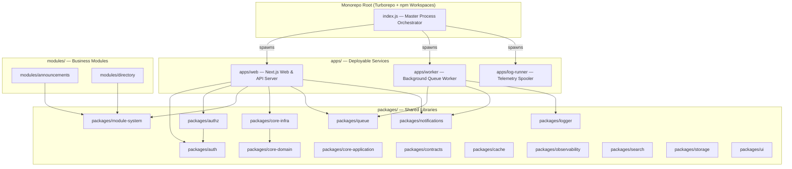
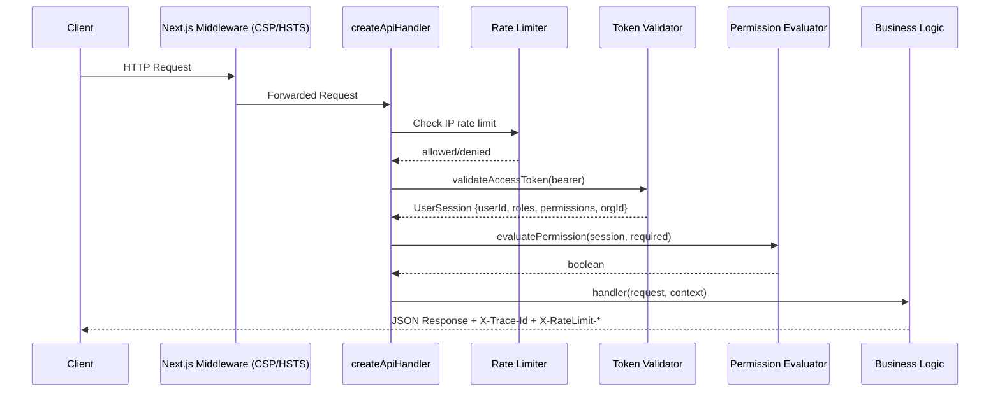
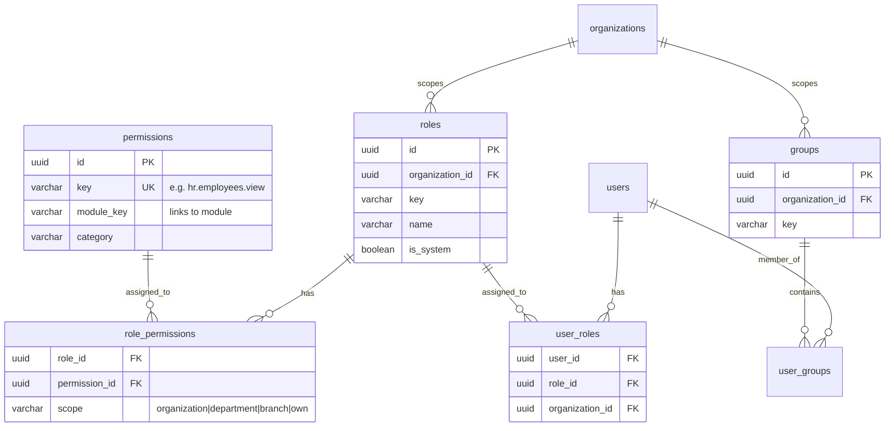
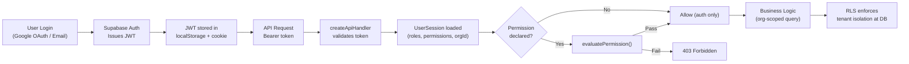

# JAAGO HUB v2.2 — Architecture Deep Dive

## 1. High-Level Architecture



The platform is a **Turborepo monorepo** with three distinct process layers orchestrated by a single [index.js](file:///e:/Antigravity/JAAGO-HUB-v2.2/index.js) master runner:

| Service | Package | Purpose |
|---------|---------|---------|
| **WEB-API** | `apps/web` | Next.js frontend + all `/api/v1/*` REST routes |
| **WORKER** | `apps/worker` | BullMQ background job processor (email, reports, notifications, webhooks, AI tasks) |
| **LOG-RUNNER** | `apps/log-runner` | Pino log spool → Supabase uploader with exponential backoff |

---

## 2. Where Modules Are Built

### 2.1 Module Definition Layer

Modules live in **two locations**:

| Location | Purpose | Examples |
|----------|---------|---------|
| [`modules/`](file:///e:/Antigravity/JAAGO-HUB-v2.2/modules) | **Business modules** with manifests, hooks, and domain logic | `announcements`, `directory` |
| [`packages/modules/_template`](file:///e:/Antigravity/JAAGO-HUB-v2.2/packages/modules/_template) | **Module scaffolding template** for `pnpm jaago module:new <key>` |

Each module consists of two files:

#### Manifest ([`manifest.ts`](file:///e:/Antigravity/JAAGO-HUB-v2.2/modules/announcements/src/manifest.ts))
Declares everything the platform needs to know:
```typescript
{
  key: 'announcements',                    // Unique slug identifier
  name: 'Circulars & Announcements',
  version: '1.0.0',
  category: 'operations',                  // core | human_capital | finance | operations | impact | utilities
  depends: ['directory'],                   // ← Dependency graph (topologically resolved)
  permissions: [                            // ← Contributed RBAC permissions
    { key: 'announcements.view', ... },
    { key: 'announcements.publish', ... },
  ],
  models: ['announcements', 'announcement_read_receipts'],
  events: {
    produces: ['announcement.published'],   // ← Event bus (produces)
    consumes: ['directory.contact.created'],// ← Event bus (consumes)
  },
  navigation: [{                            // ← Auto-registered sidebar items
    key: 'announcements', path: '/announcements',
    icon: 'Megaphone', order: 16,
    permission: 'announcements.view',       // ← Permission-gated nav
  }],
  autoInstall: true,
}
```

#### Runtime Module ([`index.ts`](file:///e:/Antigravity/JAAGO-HUB-v2.2/modules/announcements/src/index.ts))
Lifecycle hooks executed per-tenant:
```typescript
export const announcementsModule: RuntimeModule = {
  manifest: announcementsManifest,
  hooks: {
    async onInstall(context)  { /* Seed data, run migrations */ },
    async onEnable(context)   { /* Activate features */ },
    async onDisable(context)  { /* Graceful teardown */ },
  },
};
```

### 2.2 Module System Engine ([`packages/module-system`](file:///e:/Antigravity/JAAGO-HUB-v2.2/packages/module-system/src))

The core infrastructure that powers the modular architecture:

| File | Role |
|------|------|
| [`manifest.ts`](file:///e:/Antigravity/JAAGO-HUB-v2.2/packages/module-system/src/manifest.ts) | Zod-validated `ModuleManifest` schema with categories, permissions, events, navigation |
| [`registry.ts`](file:///e:/Antigravity/JAAGO-HUB-v2.2/packages/module-system/src/registry.ts) | `ModuleRegistry` singleton — registers modules, aggregates navigation & permissions across active modules |
| [`resolver.ts`](file:///e:/Antigravity/JAAGO-HUB-v2.2/packages/module-system/src/resolver.ts) | **Kahn's topological sort** for install-order resolution + cyclic dependency detection + cascade uninstall |
| [`lifecycle.ts`](file:///e:/Antigravity/JAAGO-HUB-v2.2/packages/module-system/src/lifecycle.ts) | Per-tenant state machine: `uninstalled → installing → active ↔ disabled → uninstalling` |

### 2.3 Module Database Schema ([`packages/core-infra/src/schema/modules.ts`](file:///e:/Antigravity/JAAGO-HUB-v2.2/packages/core-infra/src/schema/modules.ts))

Four Drizzle ORM tables persist module state:

| Table | Purpose |
|-------|---------|
| `platform_modules` | Global catalog of all available modules (key, version, category) |
| `platform_module_dependencies` | Dependency edges between modules |
| `installed_modules` | **Per-tenant** install state (status: `active`/`disabled`/`upgrading`/`uninstalling`, settings JSON) |
| `platform_module_migrations` | Checksummed migration history per module per tenant |

### 2.4 HR Module Specifically

HR is currently built across **three layers**:

1. **Database schema**: [`packages/core-infra/src/schema/hr.ts`](file:///e:/Antigravity/JAAGO-HUB-v2.2/packages/core-infra/src/schema/hr.ts) — defines `hr_departments`, `hr_designations`, `hr_employees` tables with org-scoped foreign keys
2. **API route**: [`apps/web/app/api/v1/hr/employees/route.ts`](file:///e:/Antigravity/JAAGO-HUB-v2.2/apps/web/app/api/v1/hr/employees/route.ts) — REST endpoints (GET list, POST create) with `createApiHandler` auth guard
3. **Dashboard UI**: [`apps/web/app/(dashboard)/hr/employees/`](file:///e:/Antigravity/JAAGO-HUB-v2.2/apps/web/app/(dashboard)/hr/employees) — Next.js pages

> [!IMPORTANT]
> HR employees currently use **in-memory seed data** in the API route, not the Drizzle schema. The schema is defined but the API routes haven't been wired to the actual database yet.

---

## 3. How APIs and Data Sync Work

### 3.1 API Architecture

All APIs are Next.js App Router route handlers under [`apps/web/app/api/v1/`](file:///e:/Antigravity/JAAGO-HUB-v2.2/apps/web/app/api/v1):

```
/api/v1/
├── route.ts                  ← API root (version info)
├── auth/                     ← Authentication endpoints
├── users/                    ← User management (CRUD, invite, link-employee)
├── hr/employees/             ← HR employee directory
├── finance/                  ← Accounting & journals
├── modules/                  ← Module catalog & lifecycle
├── organizations/            ← Org management
├── control-center/           ← System administration
├── notifications/            ← In-app & email notifications
├── workflows/                ← State-machine workflow engine
├── reports/                  ← Async report generation
├── search/                   ← Full-text search
├── logs/                     ← Observability logs
├── integrations/             ← External system connectors
├── ai/                       ← AI diagnostic features
├── studio/                   ← Custom fields (Studio-lite)
└── api-keys/                 ← API key management
```

### 3.2 The `createApiHandler` Pattern

Every authenticated API route uses the [`createApiHandler`](file:///e:/Antigravity/JAAGO-HUB-v2.2/packages/authz/src/guard.ts#L22-L143) factory from `@jaago/authz`:



The pipeline handles:
- **Distributed tracing** via `X-Trace-Id` / `X-Request-Id` headers (propagated by `@jaago/observability`)
- **Rate limiting** per IP with configurable tiers
- **Authentication** via Bearer token → Supabase Auth validation
- **Authorization** via permission check (covered below)
- **Standard error envelopes** via `@jaago/contracts`

### 3.3 Data Flow & Sync Mechanisms

The platform uses **multiple data sync strategies**:

#### A. Direct Supabase/PostgreSQL (Primary Data Store)
- Database client: [`packages/core-infra/src/db/client.ts`](file:///e:/Antigravity/JAAGO-HUB-v2.2/packages/core-infra/src/db/client.ts) — Drizzle ORM + `postgres` driver with connection pooling
- Repository pattern: [`UserRepository`](file:///e:/Antigravity/JAAGO-HUB-v2.2/packages/core-infra/src/repositories/user.repository.ts), `OrganizationRepository`, `AuditRepository`
- RLS (Row Level Security): [`rls.ts`](file:///e:/Antigravity/JAAGO-HUB-v2.2/packages/core-infra/src/db/rls.ts) sets `SET LOCAL app.current_organization_id` per-request for tenant isolation

#### B. In-Memory Data (Development / Demo Mode)
- [`apps/web/lib/users-db.ts`](file:///e:/Antigravity/JAAGO-HUB-v2.2/apps/web/lib/users-db.ts) — In-memory user array with CRUD helpers
- HR employees API route uses hardcoded seed data
- Module registry uses in-memory `Map<string, RuntimeModule>`

#### C. Async Queue (BullMQ via Redis)
- [`packages/queue`](file:///e:/Antigravity/JAAGO-HUB-v2.2/packages/queue/src/queues.ts) — 5 named queues: `email`, `reports`, `notifications`, `webhooks`, `ai-tasks`
- Jobs have **idempotency keys** for deduplication and **configurable retries with backoff**
- [`apps/worker`](file:///e:/Antigravity/JAAGO-HUB-v2.2/apps/worker/src/index.ts) processes jobs from all queues with concurrency control

#### D. Event-Driven Module Communication
Modules declare events in their manifests:
```
directory produces: ['directory.contact.created', 'directory.contact.updated']
directory consumes: ['user.created', 'user.updated']

announcements produces: ['announcement.published', 'announcement.broadcasted']
announcements consumes: ['directory.contact.created']
```

> [!NOTE]
> The event bus is **declared in manifests** but the actual pub/sub dispatch infrastructure (e.g., Redis Pub/Sub or an in-process EventEmitter) is not yet wired. Currently this is a contract/design surface — modules declare their event dependencies for the dependency resolver and future implementation.

#### E. Notification Sync
- [`packages/notifications/src/engine.ts`](file:///e:/Antigravity/JAAGO-HUB-v2.2/packages/notifications/src/engine.ts) — `NotificationEngine` dispatches to in-app (in-memory array) + email (via adapter)
- Flood control prevents notification storms per user
- Multi-channel: `in_app`, `email`, `push`, `sms`, `webhooks`

---

## 4. Role-Based Access Control (RBAC) System

The RBAC system spans **four layers** across the platform:

### 4.1 Database Schema ([`packages/core-infra/src/schema/rbac.ts`](file:///e:/Antigravity/JAAGO-HUB-v2.2/packages/core-infra/src/schema/rbac.ts))



Key design decisions:
- **Roles are org-scoped**: Each organization defines its own roles (no global role pollution)
- **`is_system` flag**: Prevents deletion/modification of built-in roles
- **Scoped permissions**: `role_permissions.scope` can be `organization`, `department`, `branch`, or `own` — enabling fine-grained access at different organizational levels
- **Groups**: Users can belong to groups (for batch permission assignment)

### 4.2 Permission Catalog ([`packages/authz/src/catalog.ts`](file:///e:/Antigravity/JAAGO-HUB-v2.2/packages/authz/src/catalog.ts))

Static catalog of all platform permissions organized by domain:

| Domain | Permissions | Module |
|--------|------------|--------|
| **System/Users** | `system.users.view`, `system.users.create`, `system.users.update`, `system.users.manage_roles` | `core` |
| **Organization** | `system.org.view`, `system.org.manage` | `core` |
| **Audit** | `system.audit.view`, `system.audit.verify` | `core` |
| **HR** | `hr.employees.view`, `hr.employees.manage` | `hr` |
| **Finance** | `finance.journals.view`, `finance.journals.post` | `finance` |

**Modules also contribute permissions** dynamically via their manifests (e.g., `announcements.view`, `announcements.publish`, `directory.view`, `directory.manage`).

### 4.3 Permission Evaluator ([`packages/authz/src/evaluator.ts`](file:///e:/Antigravity/JAAGO-HUB-v2.2/packages/authz/src/evaluator.ts#L17-L48))

The evaluation follows a **5-step priority chain**:

```
1. Super Admin bypass     → isSuperAdmin === true → ALLOW
2. Tenant isolation       → target.orgId !== subject.orgId → DENY (hard wall)
3. Global wildcard        → permissions includes '*' OR role is 'super_admin' → ALLOW
4. Exact match            → permissions includes 'hr.employees.view' → ALLOW
5. Domain wildcard match  → permissions includes 'hr.*' satisfies 'hr.employees.view' → ALLOW
6. Default                → DENY
```

### 4.4 Session & Token Flow ([`packages/auth/src/session.ts`](file:///e:/Antigravity/JAAGO-HUB-v2.2/packages/auth/src/session.ts))

```typescript
interface UserSession {
  userId: string;
  email: string;
  organizationId: string;   // Tenant isolation key
  roles: string[];           // ['super_admin', 'coordinator']
  permissions: string[];     // ['system.*', 'hr.*', 'finance.*']
  isSuperAdmin: boolean;
  mfaVerified: boolean;
}
```

Token validation flow:
1. If Supabase URL is mock/missing → return hardcoded dev session
2. Call `supabase.auth.getUser(token)` → extract roles/permissions from `user_metadata`
3. Fallback for enterprise tokens → return default admin session
4. All else → throw `UnauthorizedError`

### 4.5 How RBAC Flows Across the Platform



**Frontend integration**: The dashboard sidebar ([`dashboard-sidebar.tsx`](file:///e:/Antigravity/JAAGO-HUB-v2.2/apps/web/components/dashboard-sidebar.tsx)) renders navigation items contributed by active modules, each gated by a `permission` field. The `ModuleRegistry.getAggregatedNavigation()` method merges all active module nav items sorted by `order`.

### 4.6 Multi-Tenancy Enforcement

Tenant isolation is enforced at **three levels**:

| Level | Mechanism | Location |
|-------|-----------|----------|
| **API** | `evaluatePermission()` rejects cross-org access | [`evaluator.ts`](file:///e:/Antigravity/JAAGO-HUB-v2.2/packages/authz/src/evaluator.ts#L23-L26) |
| **Repository** | All queries include `WHERE organization_id = ?` | [`user.repository.ts`](file:///e:/Antigravity/JAAGO-HUB-v2.2/packages/core-infra/src/repositories/user.repository.ts) |
| **Database** | PostgreSQL RLS policies via `SET LOCAL app.current_organization_id` | [`rls.ts`](file:///e:/Antigravity/JAAGO-HUB-v2.2/packages/core-infra/src/db/rls.ts) |

---

## 5. Current State Summary

| Area | Status | Notes |
|------|--------|-------|
| Module system architecture | ✅ Fully built | Registry, resolver, lifecycle, manifest validation |
| Announcements module | ✅ Manifest + hooks | Needs actual CRUD routes & UI pages |
| Directory module | ✅ Manifest + hooks | Needs actual CRUD routes & UI pages |
| HR module | ⚠️ Partially wired | DB schema exists, API uses in-memory data, UI pages exist |
| RBAC schema | ✅ Complete | roles, permissions, role_permissions, user_roles, groups |
| RBAC evaluator | ✅ Complete | 5-step evaluation with wildcard support |
| Auth integration | ✅ Complete | Supabase Auth + Google OAuth + domain restriction |
| API guard pattern | ✅ Complete | `createApiHandler` with rate limiting + auth + authz |
| Queue system | ✅ Complete | 5 queues with idempotency + background worker |
| Event bus dispatch | ⚠️ Declared only | Manifests declare events but no runtime pub/sub wiring |
| Notification engine | ✅ Complete | In-app + email with flood control |
| Database layer | ✅ Complete | Drizzle ORM + PostgreSQL + RLS + connection pooling |
