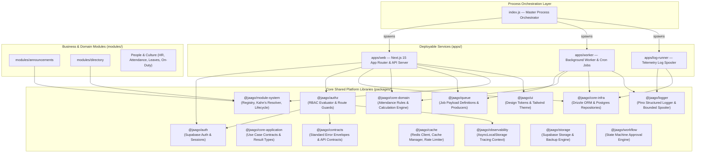
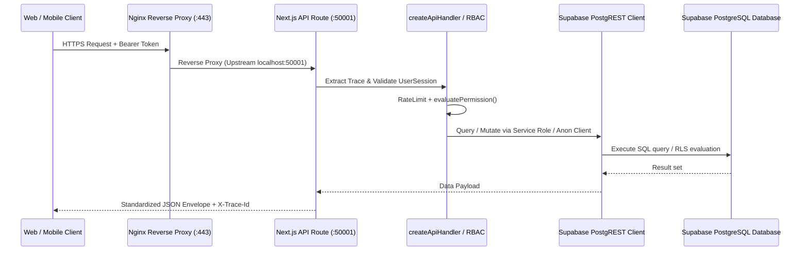

# JAAGO HUB v2.2 — Architecture Deep Dive & Comprehensive Anomaly Audit
**Date:** 2026-08-30  
**Version:** 2.2.0  
**Status:** Canonical Reference & Architectural Audit  
**Audience:** Platform Architects, Core Developers, Security & DevOps Engineers

---

## Table of Contents
1. [Executive Summary](#1-executive-summary)
2. [High-Level Platform Architecture](#2-high-level-platform-architecture)
3. [Service Process Orchestration](#3-service-process-orchestration)
4. [Module System Architecture](#4-module-system-architecture)
5. [Authentication, RBAC & Multi-Tenancy Architecture](#5-authentication-rbac--multi-tenancy-architecture)
6. [Data Flow, Synchronization & Storage Paradigms](#6-data-flow-synchronization--storage-paradigms)
7. [Comprehensive Anomaly & Inconsistency Audit](#7-comprehensive-anomaly--inconsistency-audit)
   - [7.1 Critical Severity (Build & Typecheck Failures)](#71-critical-severity-build--typecheck-failures)
   - [7.2 Critical Severity (Security Vulnerabilities & Secrets Exposure)](#72-critical-severity-security-vulnerabilities--secrets-exposure)
   - [7.3 High Severity (Architectural Bifurcation & Paradigm Disconnects)](#73-high-severity-architectural-bifurcation--paradigm-disconnects)
   - [7.4 Medium Severity (Operational, Infrastructure & Tooling Discrepancies)](#74-medium-severity-operational-infrastructure--tooling-discrepancies)
8. [Summary Matrix & Actionable Remediation Roadmap](#8-summary-matrix--actionable-remediation-roadmap)

---

## 1. Executive Summary

JAAGO HUB v2.2 is an enterprise-grade, multi-tenant Modular ERP system developed for the JAAGO Foundation. It is structured as a Turborepo monorepo encompassing three primary deployable services, 16+ core shared libraries, and extensible business modules.

A comprehensive architectural audit conducted on **2026-08-30** evaluated:
- Monorepo structure, build configuration, and dependency graphs
- Process runners and supervisor/systemd service configurations
- API gateway, authentication, rate-limiting, and RBAC enforcement
- Database layers (Drizzle ORM, Supabase PostgreSQL, and PostgREST)
- Queue, caching, locking, and asynchronous worker systems
- Production Nginx configurations and Content Security Policies (CSP)

While the platform has a robust foundation with well-designed abstractions (such as the topological module resolver, request tracing context propagation, and structured JSON log spooling), several **critical bugs, security exposures, and architectural paradigm splits** were uncovered across the codebase.

---

## 2. High-Level Platform Architecture



---

## 3. Service Process Orchestration

The platform supports two deployment topologies:

### 3.1 Universal Master Runner (`node index.js`)
Orchestrated by [`index.js`](file:///e:/Antigravity/JAAGO-HUB-v2.2/index.js), this master supervisor starts and monitors child processes using `npm run dev` (in development) or `npm run start` (in production) across workspaces:
- **`WEB-API` (`apps/web`)**: Next.js 15 server listening on `$PORT` (default `3000`, production `50001`).
- **`WORKER` (`apps/worker`)**: BullMQ & Node.js background worker executing scheduled attendance tasks and queued jobs.
- **`LOG-RUNNER` (`apps/log-runner`)**: Daemon uploading gzip-compressed log batches from `/var/lib/jaago-hub/log-spool` to Supabase.

### 3.2 Systemd / Supervisor Deployment Configurations
- **Supervisor Monolith**: [`ops/supervisor/hub-jaago.ini`](file:///e:/Antigravity/JAAGO-HUB-v2.2/ops/supervisor/hub-jaago.ini) runs `node index.js` as a managed daemon.
- **Supervisor Modular**: [`ops/supervisor/jaago-hub-modular.ini`](file:///e:/Antigravity/JAAGO-HUB-v2.2/ops/supervisor/jaago-hub-modular.ini) runs each service separately in a `[group:jaago]`.
- **Systemd Units**: [`ops/systemd/jaago-web.service`](file:///e:/Antigravity/JAAGO-HUB-v2.2/ops/systemd/jaago-web.service), `jaago-worker.service`, and `jaago-log-runner.service`.

---

## 4. Module System Architecture

The module system in [`packages/module-system`](file:///e:/Antigravity/JAAGO-HUB-v2.2/packages/module-system) implements an Odoo-class modular architecture:

```
packages/module-system/src/
├── manifest.ts     ← Zod-validated ModuleManifest schema
├── registry.ts     ← ModuleRegistry singleton aggregating navigation & permissions
├── resolver.ts     ← Kahn's topological sort for dependency & install resolution
└── lifecycle.ts    ← State machine (uninstalled → installing → active ↔ disabled → uninstalling)
```

### 4.1 Dependency Resolution & Lifecycle
- **Topological Sorting**: Modules declare dependencies in `manifest.depends: string[]`. `DependencyResolver` uses Kahn's algorithm to resolve correct installation order and detect circular dependency graphs.
- **Dynamic Navigation & Permissions**: Active modules dynamically register sidebar menu entries (`NavigationItem`) and fine-grained permissions into the platform navigation bar and permission evaluator.

---

## 5. Authentication, RBAC & Multi-Tenancy Architecture

### 5.1 RBAC Evaluation Pipeline
Permissions are validated using a 5-tier evaluation chain in [`packages/authz/src/evaluator.ts`](file:///e:/Antigravity/JAAGO-HUB-v2.2/packages/authz/src/evaluator.ts):

```
1. SuperAdmin Bypass      → isSuperAdmin === true                        → ALLOW
2. Multi-Tenant Hard Wall → subject.orgId !== target.orgId               → DENY
3. Global Wildcard        → permissions.includes('*')                    → ALLOW
4. Exact Match            → permissions.includes(requiredPermission)     → ALLOW
5. Domain Wildcard        → permissions.includes('hr.*') for 'hr.view'   → ALLOW
6. Default                →                                              → DENY
```

### 5.2 The `createApiHandler` Gateway Wrapper
The standard API architecture wraps route handlers with [`createApiHandler`](file:///e:/Antigravity/JAAGO-HUB-v2.2/packages/authz/src/guard.ts), enforcing:
1. **Trace Propagation**: Injects `X-Trace-Id` and `X-Request-Id` into `AsyncLocalStorage` and response headers.
2. **IP Rate Limiting**: Distributed rate checks per tier (`API`, `AUTH`, `WRITE`, etc.) via `@jaago/cache`.
3. **Session Extraction & Auth**: Validates Supabase JWT Bearer token into a `UserSession`.
4. **RBAC Guard**: Rejects unauthorized access with `403 Forbidden` (`AUTHZ_INSUFFICIENT_PERMISSIONS`).
5. **Standardized Envelope**: Catches domain/infrastructure exceptions and emits uniform `@jaago/contracts` JSON responses.

---

## 6. Data Flow, Synchronization & Storage Paradigms



The system interacts with PostgreSQL through two parallel pathways:
1. **Supabase PostgREST & Auth**: High-performance HTTP client used across Next.js API routes and React client components.
2. **Drizzle ORM Client**: Direct PostgreSQL connection (`packages/core-infra/src/db/client.ts`) designed for schema migrations, RLS session configuration (`SET LOCAL app.current_organization_id`), and repository patterns.

---

## 7. Comprehensive Anomaly & Inconsistency Audit

### 7.1 Critical Severity (Build & Typecheck Failures)

#### 🔴 Anomaly 1: `@jaago/worker` TypeScript Compilation Failure
- **Files**: [`apps/worker/package.json`](file:///e:/Antigravity/JAAGO-HUB-v2.2/apps/worker/package.json), [`apps/worker/src/jobs/absence-evaluation.ts`](file:///e:/Antigravity/JAAGO-HUB-v2.2/apps/worker/src/jobs/absence-evaluation.ts#L1), [`apps/worker/src/jobs/auto-checkout.ts`](file:///e:/Antigravity/JAAGO-HUB-v2.2/apps/worker/src/jobs/auto-checkout.ts#L1)
- **Problem**: Running `npm run typecheck` fails the entire monorepo build with the following compiler errors:
  ```text
  src/jobs/absence-evaluation.ts(1,30): error TS2307: Cannot find module '@supabase/supabase-js' or its corresponding type declarations.
  src/jobs/absence-evaluation.ts(66,63): error TS7006: Parameter 'r' implicitly has an 'any' type.
  src/jobs/auto-checkout.ts(1,30): error TS2307: Cannot find module '@supabase/supabase-js' or its corresponding type declarations.
  ```
- **Root Cause**: `@supabase/supabase-js` is imported directly in the worker jobs without being listed in `apps/worker/package.json` dependencies. Furthermore, strict TypeScript configuration flags untyped lambda parameters in `(existingRecords || []).map((r) => r.employee_id)`.

---

### 7.2 Critical Severity (Security Vulnerabilities & Secrets Exposure)

#### 🔴 Anomaly 2: Hardcoded Production Service Role JWT Secrets in Source Code
- **Files**:
  - [`apps/worker/src/jobs/absence-evaluation.ts:L4-5`](file:///e:/Antigravity/JAAGO-HUB-v2.2/apps/worker/src/jobs/absence-evaluation.ts#L4-L5)
  - [`apps/worker/src/jobs/auto-checkout.ts:L5-6`](file:///e:/Antigravity/JAAGO-HUB-v2.2/apps/worker/src/jobs/auto-checkout.ts#L5-L6)
  - [`packages/auth/src/client.ts:L11-15,35-39,57-61`](file:///e:/Antigravity/JAAGO-HUB-v2.2/packages/auth/src/client.ts#L11-L15)
  - [`apps/web/lib/supabase-auth.ts:L21-26`](file:///e:/Antigravity/JAAGO-HUB-v2.2/apps/web/lib/supabase-auth.ts#L21-L26)
- **Problem**: Full live Supabase instance URLs (`https://fnemsvwejymnqpufumhj.supabase.co`) and live `SUPABASE_SERVICE_ROLE_KEY` JWT tokens (`eyJhbGciOiJIUzI1NiIsInR5cCI6IkpXVCJ9...`) are hardcoded as fallback string literals in source code.
- **Impact**: Violates [`DATABASE-STANDARD.md`](file:///e:/Antigravity/JAAGO-HUB-v2.2/DATABASE-STANDARD.md) §5.1. Anyone with repository access or who inspects client/worker bundles gains administrative access to the database, bypassing Row Level Security entirely.

#### 🔴 Anomaly 3: Universal SuperAdmin Bypass on Arbitrary Tokens
- **File**: [`packages/auth/src/session.ts:L51-61`](file:///e:/Antigravity/JAAGO-HUB-v2.2/packages/auth/src/session.ts#L51-L61)
- **Problem**: In `validateAccessToken(token)`:
  ```typescript
  if (token.startsWith('jwt-') || token.startsWith('jaago_') || token.length > 20) {
    return {
      userId: 'c8a1f5e4-3231-442c-ab13-c7d9b473e4d5',
      email: 'nasif.kamal@jaago.com.bd',
      roles: ['super_admin', 'coordinator'],
      permissions: ['system.*', 'hr.*', 'finance.*', 'pnc.*', 'directory.*', 'announcements.*'],
      isSuperAdmin: true,
      mfaVerified: true,
    };
  }
  ```
- **Impact**: Any arbitrary string longer than 20 characters automatically validates as SuperAdmin with full wildcard permissions across all platform modules.

---

### 7.3 High Severity (Architectural Bifurcation & Paradigm Disconnects)

#### 🟠 Anomaly 4: Dual API Route Architecture (Guarded Standard vs Unguarded Raw)
- **Problem**: The monorepo has two mutually contradictory API design implementations:
  1. **Standardized Kernel Routes** (`reports`, `workflows`, `studio`, `search`, `notifications`, `integrations`, `organizations`, `logs`, `modules`, `finance`, `api-keys`, `ai`): Wrapped in `createApiHandler`, enforcing rate limits, Bearer authentication, RBAC permission checks, request tracing, and standardized `@jaago/contracts` JSON envelopes.
  2. **Unguarded Raw Routes** (`hr/employees`, `hr/organization`, `hr/entities/*`, `attendance/*`, `users/*`, `on-duty/*`, `admin/gps-locations`): Export raw Next.js Route Handlers (`export async function GET/POST`), bypassing `createApiHandler`, calling `getSupabaseAdminClient()` directly, skipping RBAC authorization, and emitting unstandardized error JSONs.

#### 🟠 Anomaly 5: Database Layer Disconnect (Drizzle ORM vs Supabase PostgREST)
- **Problem**: [`packages/core-infra`](file:///e:/Antigravity/JAAGO-HUB-v2.2/packages/core-infra) defines full Drizzle schemas, connection pools, and repositories (`UserRepository`, `OrganizationRepository`, `AuditRepository`). However:
  - **None of these repositories or Drizzle clients are ever invoked by `apps/web` or `apps/worker`**.
  - All active API routes and UI components interact exclusively with Supabase PostgREST or in-memory arrays.
  - The Drizzle layer and Supabase migrations have diverged into two unlinked database stacks.

#### 🟠 Anomaly 6: Schema and Model Naming Divergence
- **Problem**:
  - **Employee Schema**: Drizzle schema ([`packages/core-infra/src/schema/hr.ts`](file:///e:/Antigravity/JAAGO-HUB-v2.2/packages/core-infra/src/schema/hr.ts)) defines `hr_employees` (UUID IDs, `salary_bdt`, `department_id` FK). Meanwhile, the active database table in Supabase migrations ([`20260824_create_employees_schema.sql`](file:///e:/Antigravity/JAAGO-HUB-v2.2/supabase/migrations/20260824_create_employees_schema.sql)) is named `employees` (50+ columns, `wage`, `salary_jul_dec`, string-based org fields).
  - **Dual Attendance Tables in Drizzle**: [`packages/core-infra/src/schema/attendance.ts`](file:///e:/Antigravity/JAAGO-HUB-v2.2/packages/core-infra/src/schema/attendance.ts) defines both `attendanceRecords` (`attendance_records` with string primary key) AND `hrAttendanceLogs` (`hr_attendance_logs` with UUID primary key) side-by-side.

#### 🟠 Anomaly 7: Queue & Background Worker Memory Isolation
- **Problem**: [`packages/queue/src/queues.ts:L23`](file:///e:/Antigravity/JAAGO-HUB-v2.2/packages/queue/src/queues.ts#L23) implements `QueueProducerManager` using an in-memory `Map` (`this.inMemoryQueue`).
- **Impact**: When `apps/web` enqueues jobs via `globalQueueProducer.enqueue()`, jobs are held in Next.js process RAM. Because `apps/worker` runs in a separate Node.js process, it cannot access the queue. The worker runs isolated interval jobs rather than consuming from Redis BullMQ.

#### 🟠 Anomaly 8: In-Memory Ephemeral State across Restarts
- **Module Lifecycle**: [`packages/module-system/src/lifecycle.ts`](file:///e:/Antigravity/JAAGO-HUB-v2.2/packages/module-system/src/lifecycle.ts#L32) maintains module installation state in a private in-memory `Map` that resets on server restart, failing to persist to the `installed_modules` table.
- **Distributed Cache & Locks**: [`packages/cache/src/cache-manager.ts`](file:///e:/Antigravity/JAAGO-HUB-v2.2/packages/cache/src/cache-manager.ts#L15) and [`packages/cache/src/lock.ts`](file:///e:/Antigravity/JAAGO-HUB-v2.2/packages/cache/src/lock.ts#L10) store caches and locks in in-process `Map` objects rather than Redis.
- **User Directory Cache**: [`apps/web/lib/users-db.ts`](file:///e:/Antigravity/JAAGO-HUB-v2.2/apps/web/lib/users-db.ts#L19) maintains an in-memory array used as a fallback.

---

### 7.4 Medium Severity (Operational, Infrastructure & Tooling Discrepancies)

#### 🟡 Anomaly 9: Broken Global Test Suite (`npm test`) on Windows
- **Files**: Root [`package.json`](file:///e:/Antigravity/JAAGO-HUB-v2.2/package.json), [`packages/testing/package.json`](file:///e:/Antigravity/JAAGO-HUB-v2.2/packages/testing/package.json), `packages/config/package.json`, `packages/logger/package.json`
- **Problem**: Running `npm test` fails immediately on Windows with:
  ```text
  Could not find 'E:\Antigravity\JAAGO-HUB-v2.2\packages\config\src\__tests__\**\*.test.ts'
  ```
- **Root Cause**: Scripts specify `"test": "tsx --test src/__tests__/**/*.test.ts"`. Windows `cmd.exe` does not natively expand shell globs, causing `tsx` to receive literal asterisk characters.

#### 🟡 Anomaly 10: Process Privilege Violation in Supervisor Config
- **Files**: [`ops/supervisor/hub-jaago.ini:L10`](file:///e:/Antigravity/JAAGO-HUB-v2.2/ops/supervisor/hub-jaago.ini#L10), [`ops/supervisor/jaago-hub-modular.ini:L8`](file:///e:/Antigravity/JAAGO-HUB-v2.2/ops/supervisor/jaago-hub-modular.ini#L8)
- **Problem**: Supervisor configurations specify `user=root`.
- **Impact**: Running Node.js application web servers directly as `root` violates the principle of least privilege. In contrast, [`ops/systemd/jaago-web.service`](file:///e:/Antigravity/JAAGO-HUB-v2.2/ops/systemd/jaago-web.service#L8) correctly configures `User=jaago`.

#### 🟡 Anomaly 11: Content Security Policy (CSP) Collision
- **Files**: [`ops/nginx/jaago-hub.conf:L42`](file:///e:/Antigravity/JAAGO-HUB-v2.2/ops/nginx/jaago-hub.conf#L42) vs [`apps/web/middleware.ts:L63-74`](file:///e:/Antigravity/JAAGO-HUB-v2.2/apps/web/middleware.ts#L63-L74)
- **Problem**: Nginx injects a loose CSP (`connect-src 'self' https:; img-src 'self' data: https:`), while Next.js middleware injects an explicit whitelist (`connect-src 'self' https://storage.jaago.com.bd https://*.supabase.co https://*.googleapis.com`).
- **Impact**: When both Nginx and Next.js emit CSP headers, browsers enforce the intersection (the most restrictive combination), leading to unexpected resource blocking.

#### 🟡 Anomaly 12: Redundant 700-line Layout in `apps/web/app/pnc`
- **Files**: [`apps/web/app/(dashboard)/layout.tsx`](file:///e:/Antigravity/JAAGO-HUB-v2.2/apps/web/app/(dashboard)/layout.tsx) vs [`apps/web/app/pnc/layout.tsx`](file:///e:/Antigravity/JAAGO-HUB-v2.2/apps/web/app/pnc/layout.tsx)
- **Problem**: `app/pnc/layout.tsx` is a 707-line standalone layout that duplicates the sidebar navigation, hover sensors, theme toggling, and user hydration already handled in the root `(dashboard)` layout.

#### 🟡 Anomaly 13: Package Manager Inconsistency
- **Files**: Root [`package.json`](file:///e:/Antigravity/JAAGO-HUB-v2.2/package.json) vs [`task.md`](file:///e:/Antigravity/JAAGO-HUB-v2.2/task.md)
- **Problem**: Root `package.json` specifies `"packageManager": "npm@10.8.2"`, whereas `task.md` and CLI documentation specify `pnpm`.

---

## 8. Summary Matrix & Actionable Remediation Roadmap

| # | Item | Category | Severity | File(s) | Recommended Remediation |
|---|---|---|---|---|---|
| **1** | Missing `@supabase/supabase-js` dependency in worker | Build | 🔴 Critical | [`apps/worker/package.json`](file:///e:/Antigravity/JAAGO-HUB-v2.2/apps/worker/package.json), [`absence-evaluation.ts`](file:///e:/Antigravity/JAAGO-HUB-v2.2/apps/worker/src/jobs/absence-evaluation.ts) | Add `@supabase/supabase-js: "^2.47.10"` to `apps/worker` dependencies; add type annotation to lambda parameters. |
| **2** | Hardcoded Service Role JWT keys | Security | 🔴 Critical | [`absence-evaluation.ts`](file:///e:/Antigravity/JAAGO-HUB-v2.2/apps/worker/src/jobs/absence-evaluation.ts), [`auto-checkout.ts`](file:///e:/Antigravity/JAAGO-HUB-v2.2/apps/worker/src/jobs/auto-checkout.ts), [`auth/client.ts`](file:///e:/Antigravity/JAAGO-HUB-v2.2/packages/auth/src/client.ts) | Remove hardcoded JWT literals; enforce strictly loading from environment variables with runtime assertion. |
| **3** | Insecure token fallback granting `super_admin` | Security | 🔴 Critical | [`packages/auth/src/session.ts`](file:///e:/Antigravity/JAAGO-HUB-v2.2/packages/auth/src/session.ts) | Restrict mock token bypass to non-production environments (`process.env.NODE_ENV !== 'production'`). |
| **4** | Dual API route architecture | Architecture | 🟠 High | `apps/web/app/api/v1/hr/*`, `attendance/*`, `users/*` | Refactor all raw route handlers to use `createApiHandler`, RBAC permission checks, and standard error envelopes. |
| **5** | Drizzle ORM disconnect | Architecture | 🟠 High | [`packages/core-infra`](file:///e:/Antigravity/JAAGO-HUB-v2.2/packages/core-infra), `apps/web` | Reconcile Drizzle repositories with Supabase PostgREST client and unify datastore access patterns. |
| **6** | Schema naming divergence (`employees` vs `hr_employees`) | Database | 🟠 High | [`packages/core-infra/src/schema/hr.ts`](file:///e:/Antigravity/JAAGO-HUB-v2.2/packages/core-infra/src/schema/hr.ts), [`attendance.ts`](file:///e:/Antigravity/JAAGO-HUB-v2.2/packages/core-infra/src/schema/attendance.ts) | Update Drizzle table schemas to mirror canonical Supabase migration tables (`employees`, `attendance_records`). |
| **7** | Process memory queue isolation | Architecture | 🟠 High | [`packages/queue/src/queues.ts`](file:///e:/Antigravity/JAAGO-HUB-v2.2/packages/queue/src/queues.ts), [`apps/worker`](file:///e:/Antigravity/JAAGO-HUB-v2.2/apps/worker) | Connect `globalQueueProducer` and `BackgroundWorkerService` to Redis via BullMQ. |
| **8** | In-memory module lifecycle & cache ephemerality | Reliability | 🟠 High | [`packages/module-system/src/lifecycle.ts`](file:///e:/Antigravity/JAAGO-HUB-v2.2/packages/module-system/src/lifecycle.ts), [`packages/cache`](file:///e:/Antigravity/JAAGO-HUB-v2.2/packages/cache) | Persist module states in `installed_modules` table; route cache and distributed locks through Redis. |
| **9** | Windows shell glob failures in test scripts | Tooling | 🟡 Medium | `packages/*/package.json` | Update test scripts to use node test runners or cross-platform test entrypoints (e.g. `tsx --test "src/__tests__/**/*.test.ts"`). |
| **10** | Supervisor process running as `root` | Operations | 🟡 Medium | [`ops/supervisor/hub-jaago.ini`](file:///e:/Antigravity/JAAGO-HUB-v2.2/ops/supervisor/hub-jaago.ini), [`jaago-hub-modular.ini`](file:///e:/Antigravity/JAAGO-HUB-v2.2/ops/supervisor/jaago-hub-modular.ini) | Update `user=root` to `user=jaago` in supervisor INI configurations. |
| **11** | Nginx and Next.js CSP collision | Operations | 🟡 Medium | [`ops/nginx/jaago-hub.conf`](file:///e:/Antigravity/JAAGO-HUB-v2.2/ops/nginx/jaago-hub.conf) | Remove redundant CSP header from Nginx and delegate security header management to Next.js middleware. |
| **12** | Duplicate layout in `app/pnc` | Frontend | 🟡 Medium | [`apps/web/app/pnc/layout.tsx`](file:///e:/Antigravity/JAAGO-HUB-v2.2/apps/web/app/pnc/layout.tsx) | Refactor `app/pnc` pages to inherit from `(dashboard)/layout.tsx` to eliminate 700 lines of duplicate layout code. |
